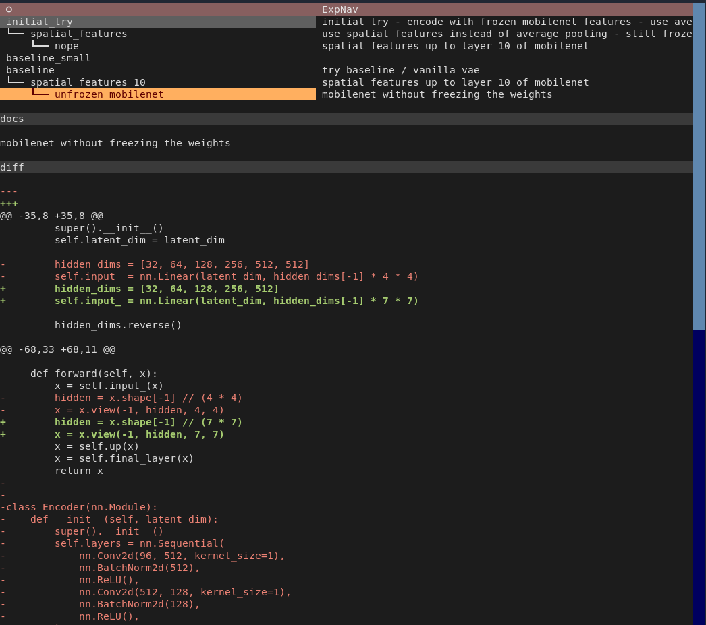

This is a very simple textual app for browsing a folder with deep learning experiments.

Use at your own risk.

# Installation

```
pip install -r requirements.txt
```

Requires at least python3.10.

# Usage

```
python -m expnav <path to experments folder>
```

The folder is expected to have the following structure:

```
├── experiment1
│   ├── meta.txt
│   ├── log.txt
│   ├── model.padl
│   │   ├── transform.py
│   │   [...]
│   [...]
├── experiment2
│   ├── meta.txt
│   ├── log.txt
│   ├── model.padl
│   │   ├── transform.py
│   │   [...]
│   [...]
[...]
```

where `meta.txt` contains 

```
parent: <name of parent experiment>

<some documentation>
```

The app shows a tree of all experiments with their ancestors. Detail views for the individual
experiments show the documentation text from `meta.txt`, their logs, and a diff wrt to the
parent model.


